# Online Store "SomeStore"

Welcome! This is my repository dedicated to the development of an online store. This project is aimed at showcasing my web development skills and my ambition to work as a web developer.

## Project Description

The goal of this project is to develop a fully functional online store using the Django framework. The website is currently under development, but I would like to present it to potential employers to demonstrate my skills and potential.

### Current Features

- Basic templates have been developed for the homepage, categories, subcategories, and product pages.
- The Django framework is utilized for creating models for categories, subcategories, and products.
- An admin panel has been integrated to facilitate the creation of categories, subcategories, and products.
- The website is responsive and optimized for various devices, ensuring a great user experience across different platforms.

### Future Development Plans

In the further development of my online store, I plan to implement the following features:

- **Product Search**: Implement a search functionality that allows users to quickly find desired products.
- **Proper Product Categorization**: Enhance the display of products based on selected categories and subcategories.
- **Reviews Section**: Create a reviews section where users can leave their feedback and reviews for products.
- **User Profile Page**: Develop a user profile page where users can edit their profile information and view their purchase history.
- **Shopping Cart and Payment**: Implement a shopping cart functionality for adding products and enable payment options through web services.
- **Background Tasks with Celery**: Integrate background tasks using Celery for handling asynchronous tasks such as notifications and processing long-running operations.
- **Logging**: Add logging mechanisms to track important events, errors, and activities within the website.

These plans reflect my vision for the continuous improvement and expansion of the online store project. I look forward to making significant progress and delivering a robust and user-friendly e-commerce solution.

## Screenshots
### Homepage
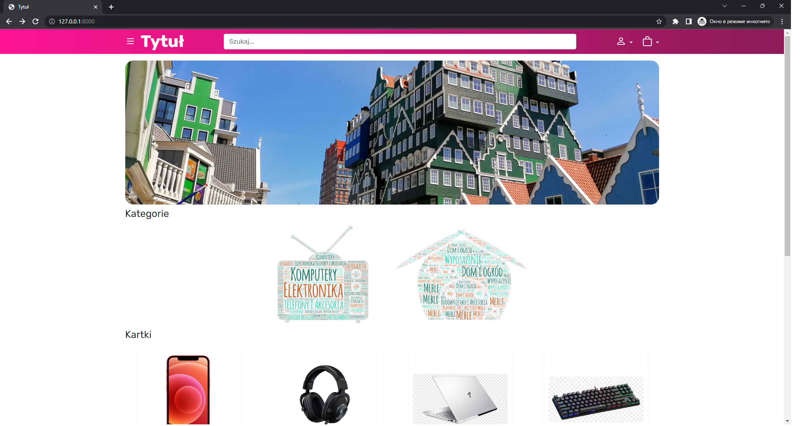
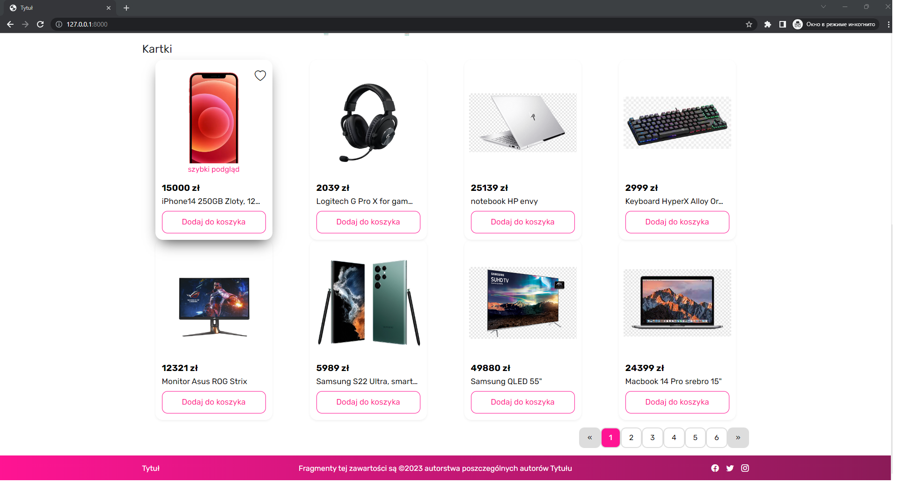
*The homepage of online store showcasing an attractive design and prominent display of products, including an automated slider for discount banners, a separate category block, and a product block.*

### Quick View Modal
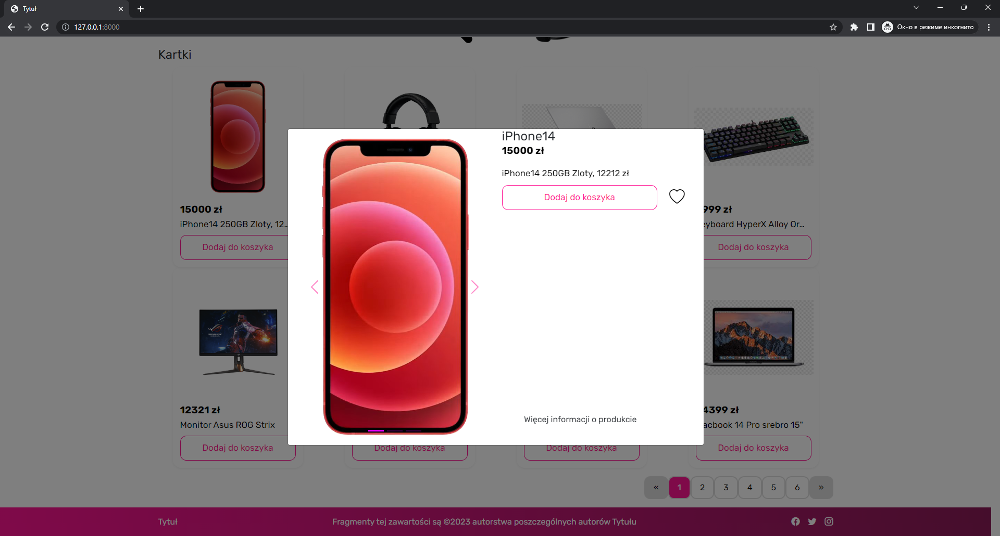
*A screenshot of the quick view feature displaying a modal window that provides a convenient way for users to get a closer look at a product. The modal includes a slider showcasing multiple product images, along with the product title, price, an add to cart button, and an add to favorites button.*

### Sliding Left Menu
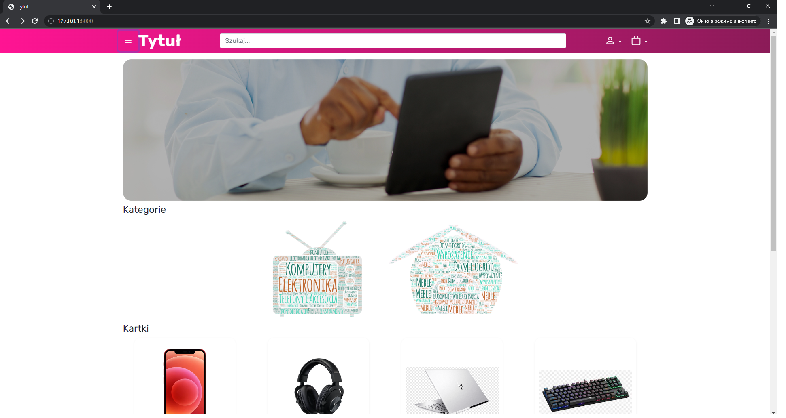
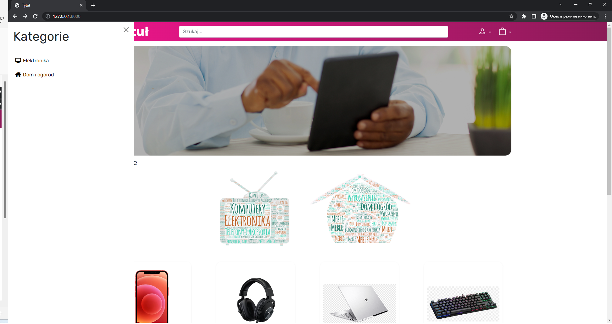
*A screenshot of the sliding left menu, providing easy navigation and access to various sections of the website, including categories, subcategories, and additional functionalities.*

### Product Page
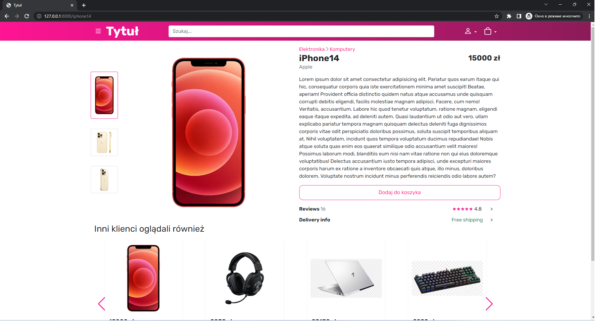
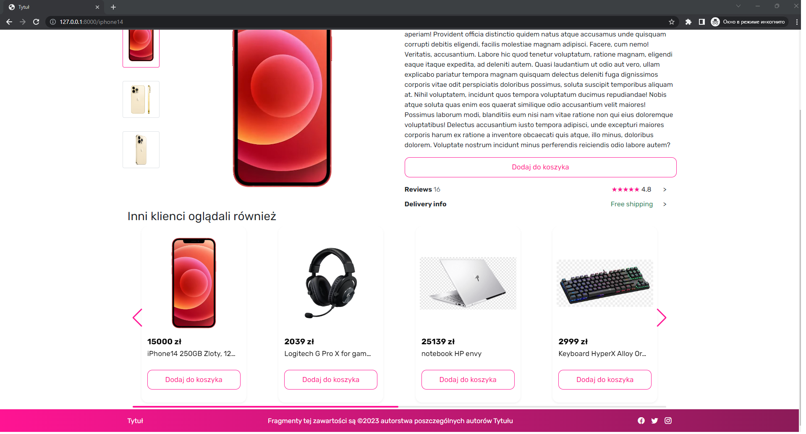
*An example product page displaying the brand name, description, price, add to cart button, and a slider showcasing other related products.*

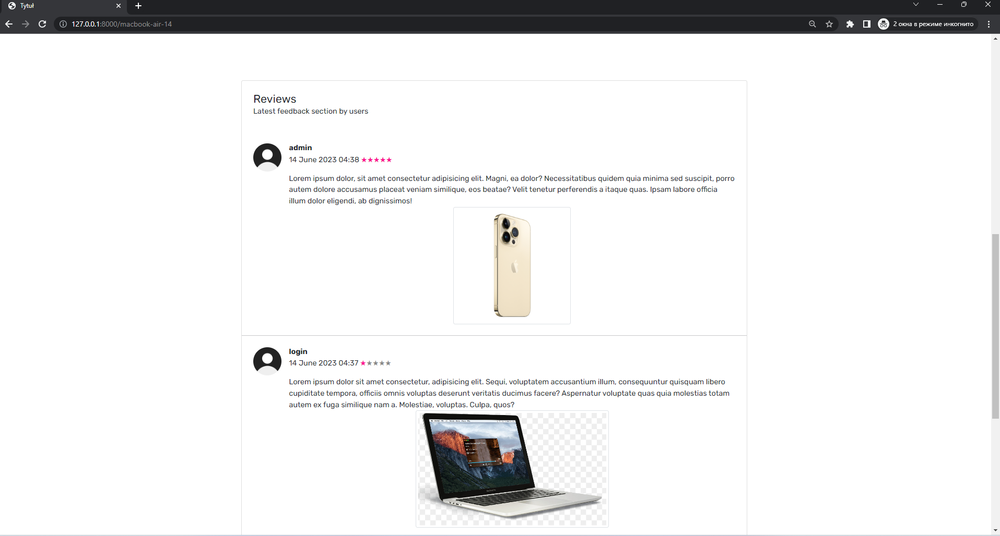
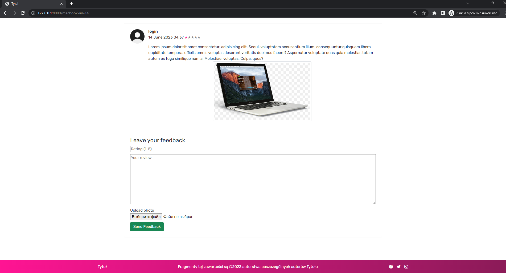
*The review section on the product page features customer feedback, ratings, and written reviews to help shoppers make informed purchasing decisions.*
### Registration Page
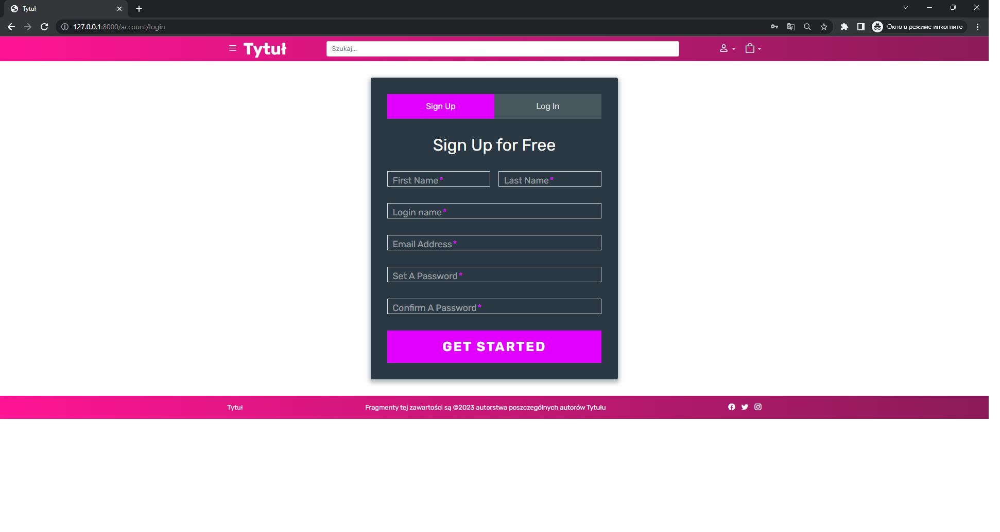
*The user registration page featuring a convenient form for creating an account and accessing personalized features.*

### Category Page
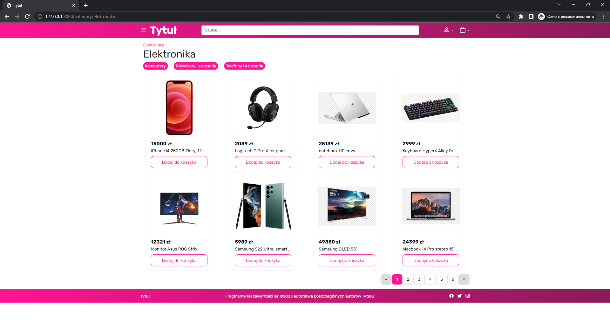
*A category page displaying a collection of products within a specific category, allowing users to browse and explore products belonging to that category.*

### Subcategory Page
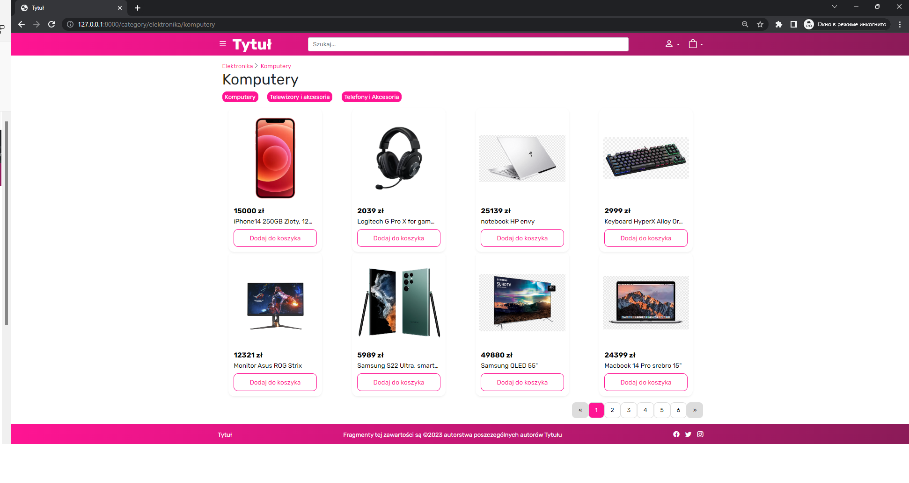
*A subcategory page showcasing a subset of products within a particular subcategory, enabling users to narrow down their search and focus on specific product types.*
